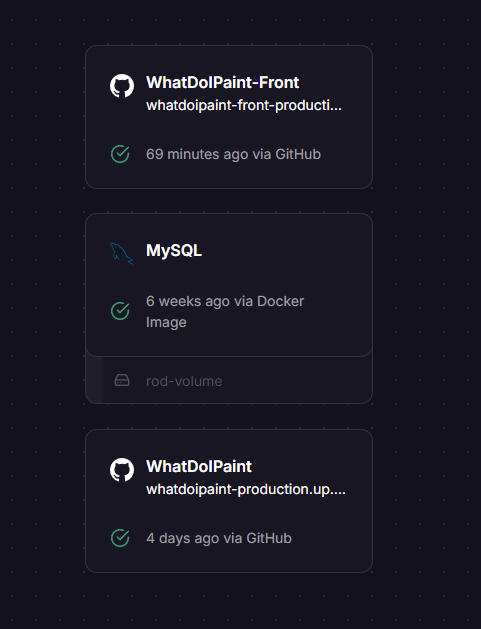

# What Do I Paint?

One of my creative hobbies is miniature painting. Talking with other people who share my love for the hobby,
we wanted to have a tool that would help us with the dreaded _pile of shame_ AKA all the unfinished projects you have at home.

I saw the opportunity to hone my abilities as a full-stack developer (although back-end is my baby) and make the tool myself.

[See the front-end repository.](https://github.com/MaraScampini/WhatDoIPaint-Front)

This website has two main purposes: to motivate you to paint every day using streaks that update whenever you mark some project
as having been painted that day, and to help you choose between the multitude of unfinished (or even un-started) projects
you have lying around using a random picker that accepts some parameters.

It also is a kind of painting diary where you can record everything you do, upload pictures of your in-progress and finished minis
and track your progress in each project.

The website is fully deployed in Railway:

I used PHP with Symfony to make the API and a MySQL relational database. It has authentication through JWT and I
took the opportunity to practice some architectural choices such as the use of interfaces for repositories and services
and custom exceptions.

I have some ideas to keep going with the project, so next up would be:

- Testing
- Cache to manage the streaks better
- Social aspect of the platform: for the user to be able to see friends' projects and feed in their page and leave comments

